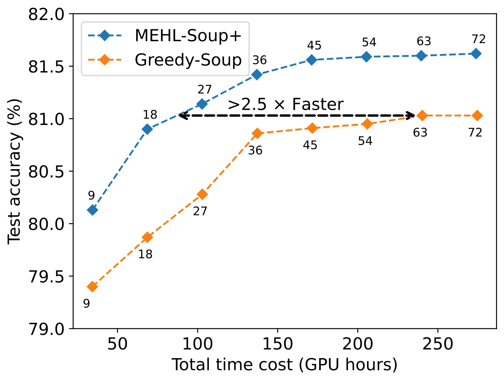

# Learning Scalable Model Soup on a Single GPU: An Efficient Subspace Training Strategy

Tao Li*, Weisen Jiang*, Fanghui Liu, Xiaolin Huang#, James T Kwok 

(*Equally contribution)

**Paper:** https://arxiv.org/abs/2407.03641

**ECCV 2024**

## Introduction
[Model soup](https://proceedings.mlr.press/v162/wortsman22a/wortsman22a.pdf) is an effective strategy for enhancing generalization performance by averaging multiple models fine-tuned from different hyper-parameter configurations into a single "soup model" in weight space. Learned soup is promising to achieve better performance than greedy soup due to its better flexibility by learning the coefficients. However, it is often less perferred in practice due to its huge memory requirements (e.g. >250GB of memory required to average 72 CLIP ViT-B/32 models). In this work, we propose an efficient and scalable strategy named **MEHL-Soup** that allows enjoying the advantages of learned soup while maintaining similiar level of memory burden to that of greedy soup.

Our approach includes two key components: **1)** a hyper-plane optimization target that enhances performance by facilitating coefficient expolation (i.e., negative coefficients) and enabling efficient coefficient optimization by gradient projection, and **2)** a mini-batch model optimization strategy that requires memory only proportional to the model batch size, ensuring scalability.

<!-- The code is raw and still under construction. We will release more friendly interface/implementation in the next couple months. -->

## Environment
Install required dependencies:
```
pip install -r requirements.txt
```

## How to run
First, fine-tune multiple models with different hyper-parameters and store them into the directory `model_dir`. As example, you can download the public avaliable checkpoints following the [code](https://github.com/mlfoundations/model-soups/blob/d5398f181ea51c5cd9d95ebacc6ea7132bb108ec/main.py#L67) from the [Model soup repo](https://github.com/mlfoundations/model-soups/tree/main) (72 CLIP ViT-B/32 models fine-tuned on ImageNet). 

Here is the example script that we use a model batch size of 18 to average 72 models expected to be run on a GPU with 24 GB memory:

```bash
#!/bin/bash

lr=0.01
wd=0.
devices=0
port=1234
model=clip-vit-b32
dataset=ImageNet
model_dir=../models/
batch=18
CUDA_VISIBLE_DEVICES=$devices python -m torch.distributed.launch \
    --nproc_per_node 1 --master_port $port MEHL_soup_layer.py \
    --lr $lr --batch-size 128 --wd $wd --epochs 5 \
    --cosine-lr --optimizer adamw --model-location $model_dir \
    --datasets $dataset --params_start 0 --params_end  72 --arch $model \
    --optimizer adamw --split --ddp --randomseed $seed \
    --finetune --model_batch $batch --models_epochs 1
```

`model_batch` is the model batch size (which can be adjusted to fit the GPU memory budget), 
`models_epochs` is the model training epochs for outer loop,
`epochs` is the training epochs for inner loop (see Algorithm 1).


We also support multi-node training to distribute the memory load and computation of gradient projection across multiple nodes, if multiple gpus are available. This technique is integrated from [TWA](https://github.com/nblt/TWA). You can try it by setting `nproc_per_node` according to the devices you have.

## Some results


Method | Acc | Time | Memory
--- | --- | --- | ---
Best individual model | 80.38 | - | -
Uniform-Soup |79.97 | - | -
Greedy-Soup | 81.03 | 3501s | 3GB
Learned-Soup+ | 81.39 | 7701s | 253GB
MEHL-Soup+ | **81.62** | **808**s | **19**GB

MEHL-Soup+ is able to reduce the fine-tuning time cost by requring fewer models for reaching a similar test accuracy compared with greedy-soup.


<!--  -->

MEHL-Soup+ is also less sensitive to top-performing models compared to Greedy-Soup, which starts from the best-performing model. For instance, after eliminating the top 42 performing models, MEHL-Soup+ still achieves over 81% accuracy, while Greedy-Soup drops to below 80% accuracy.

models eliminated | - |  Top-2 |  Top-22 | Top-42
---|---|---|---|---
Greedy-Soup |  81.03 |  80.78 |  80.08 |  79.70
MEHL-Soup+ | 81.62(+**0.59**) |  81.58(+**0.80**) | 81.44(+**1.36**) | 81.01(+**1.31**)


